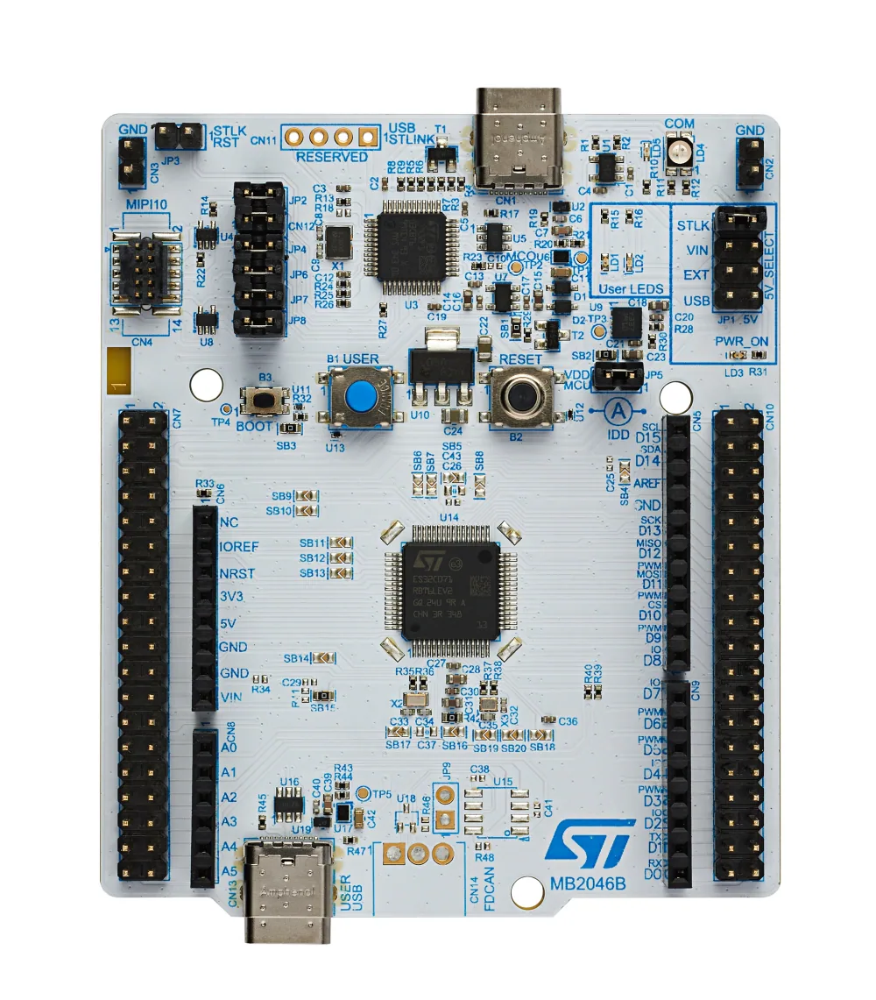
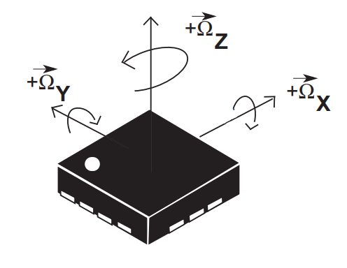
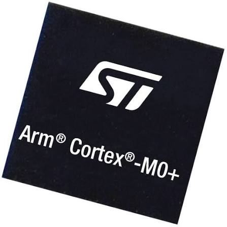

# Hardware Documents

## STM32 board and Usage (STM32C071)

---

  

---

- [Nucleo Board User Manual](https://www.st.com/resource/en/user_manual/um3353-stm32-nucleo64-board-mb2046-stmicroelectronics.pdf)
- [ARM Based MCUs Reference Manual](https://www.st.com/resource/en/reference_manual/rm0490-stm32c0-series-advanced-armbased-32bit-mcus-stmicroelectronics.pdf)
- [Board Datasheet](https://www.st.com/resource/en/datasheet/stm32c071kb.pdf)
- [HAL and Lowlayer User Manual](https://www.st.com/resource/en/user_manual/um3029-description-of-stm32c0-hal-and-lowlayer-drivers-stmicroelectronics.pdf)

## IMU (LSM6DS)

---

---

- [Datasheet](https://www.st.com/resource/en/datasheet/lsm6ds3tr-c.pdf)

## ARM Cortex-M0+ (Processor core this MCU uses)

---

---

- [User Guide](https://support.arm.com/documentation/dui0662/b)

---
[<- Back to project README](./README.md)
