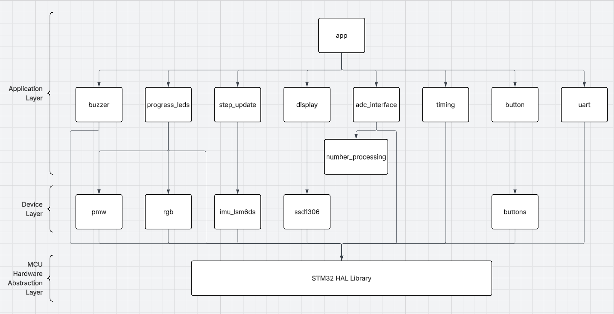

# Source Code — STM32 Step Counter

Direct links to every source file, grouped by architecture as described by the [design report](./StepcounterReport.pdf). 
Header are located in the standard CubeIDE (Core/Inc) layout alongside (Core/Src) for the source files.

---

---

## Upper Application Layer

- [app.c](./Code/Core/Src/app.c) / [app.h](./Code/Core/Inc/app.h) - task scheduling, module configuration, and shared data structures; deliberately kept without direct HAL access to stay decoupled from the hardware drivers below

## Sensor & Peripheral Interactors

- [step_update.c](./Code/Core/Src/step_update.c) / [step_update.h](./Code/Core/Inc/step_update.h)         - IMU step-count driver over SPI; runs only on the IMU's rising-edge interrupt, reads the step delta from the LSM6DS registers, and updates the running total with NVIC interrupts briefly disabled to prevent a race condition
- [adc_interface.c](./Code/Core/Src/adc_interface.c) / [adc_interface.h](./Code/Core/Inc/adc_interface.h) - potentiometer and joystick analog reads via DMA (block/burst transfer, required by STM32 for multi-element ADC reads)
- [display.c](./Code/Core/Src/display.c) / [display.h](./Code/Core/Inc/display.h)                         - OLED output; renders the current GUI state (steps / goal progress / distance) via a state-driven display switch
- [progress_leds.c](./Code/Core/Src/progress_leds.c) / [progress_leds.h](./Code/Core/Inc/progress_leds.h) - RGB LED driver, scaling brightness with progress toward the step goal
- [buzzer.c](./Code/Core/Src/buzzer.c) / [buzzer.h](./Code/Core/Inc/buzzer.h)                             - piezoelectric buzzer driver; sets TIM16's ARR/CCR for a fixed 50% duty-cycle tone, with a small note/tune library and a latch ensuring the goal-reached tune fires exactly once per goal completion
- [button.c](./Code/Core/Src/button.c) / [button.h](./Code/Core/Inc/button.h)                             - button input handling, including the double-click gesture used to enter test mode
- [uart.c](./Code/Core/Src/uart.c) / [uart.h](./Code/Core/Inc/uart.h)                                     - UART debug output, toggled on via button

## Support / Utility For Specific Functionality 

- [number_processing.c](./Code/Core/Src/number_processing.c) / [number_processing.h](./Code/Core/Inc/number_processing.h) - numerical calculations helper for ADC values; this is a module worth simplifying in a future revision
- [timing.c](./Code/Core/Src/timing.c) / [timing.h](./Code/Core/Inc/timing.h)                                             - task tick/timing definitions; this module is more tightly coupled to the app module than intended and needs reworking to allow for pluggin functonaity

---
[<- Back to project README](./README.md)
